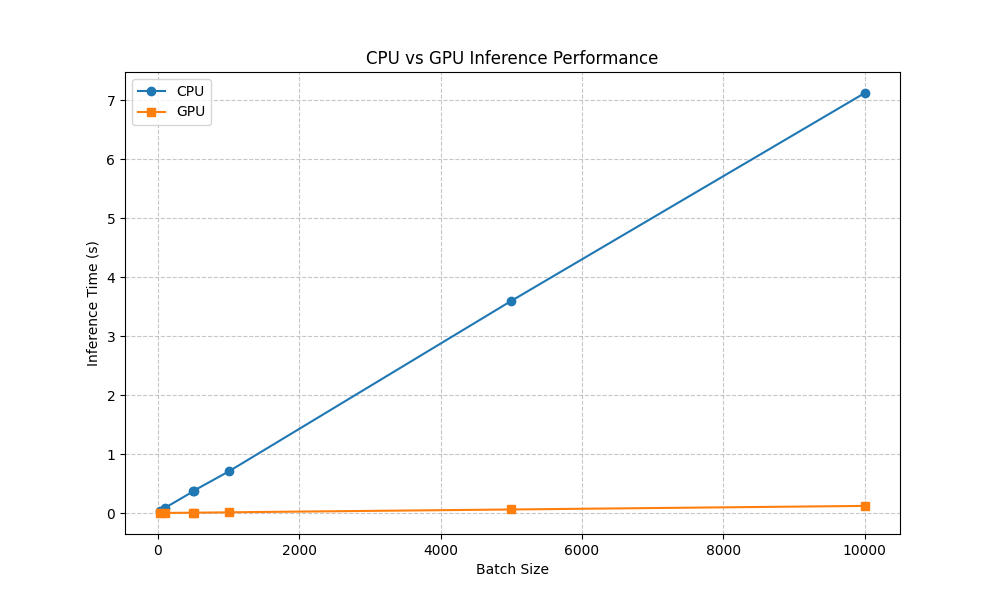

# CudaGrad

A lightweight autograd engine with GPU acceleration! Inspired by Andrej Karpathy's [micrograd](https://github.com/karpathy/micrograd).

## Features

- GPU acceleration using CUDA through CuPy and RawKernel
- 2D tensor operations with automatic differentiation
- Neural network building blocks (Neuron, Layer, MLP)
- Support for both CPU and GPU backends
- MNIST training example

## Example Usage

### Training a Simple Neural Network

```python
from src.tensor import Tensor
from src.nn import MLP

# Create a simple neural network
model = MLP(2, [16, 1], device='GPU')  # 2 inputs, 16 hidden neurons, 1 output

# Create some training data (XOR problem)
X = Tensor([[0, 0], [0, 1], [1, 0], [1, 1]], device='GPU')
y = Tensor([[0], [1], [1], [0]], device='GPU')

# Training loop
learning_rate = 0.01
for epoch in range(100):
    # Forward pass
    out = model(X)
    
    # Compute loss (MSE)
    loss = ((out - y) ** 2).mean()
    
    # Backward pass
    model.zero_grad()
    loss.backward()
    
    # Update weights
    for p in model.parameters():
        p.data -= learning_rate * p.grad
    
    if epoch % 10 == 0:
        print(f"Epoch {epoch}, Loss: {loss.data}")

# Test the model
test_input = Tensor([[0, 1]], device='GPU')
prediction = model(test_input)
print(f"Prediction for [0, 1]: {prediction.data}")
```

## Performance


## To-do list

- [x] Experiment with more operations and optimized GPU kernels (kinda)
- [ ] Overhaul CuPy raw kernels and use ctypes to bind custom CUDA kernels
